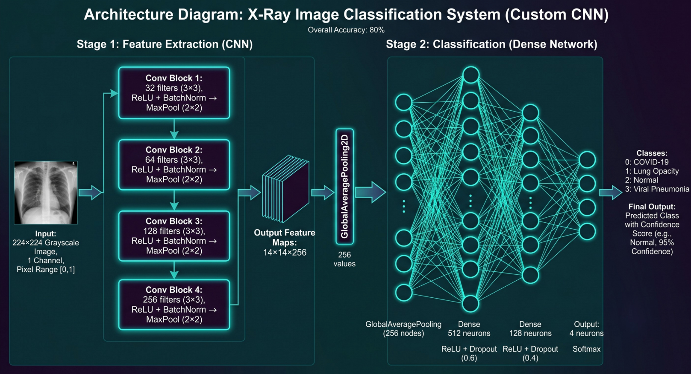
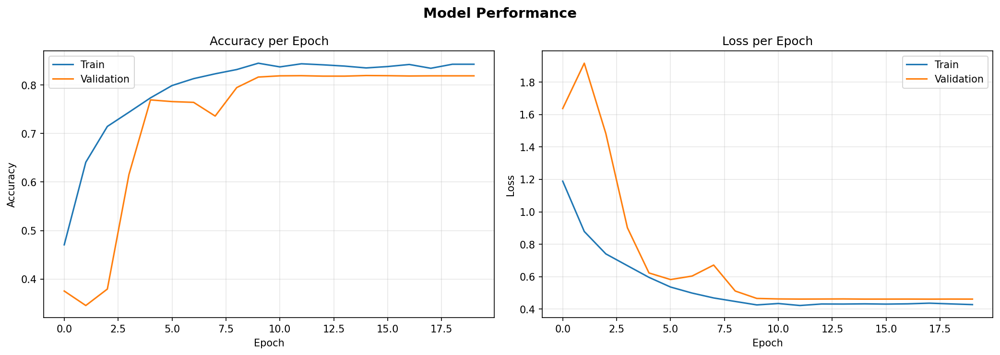
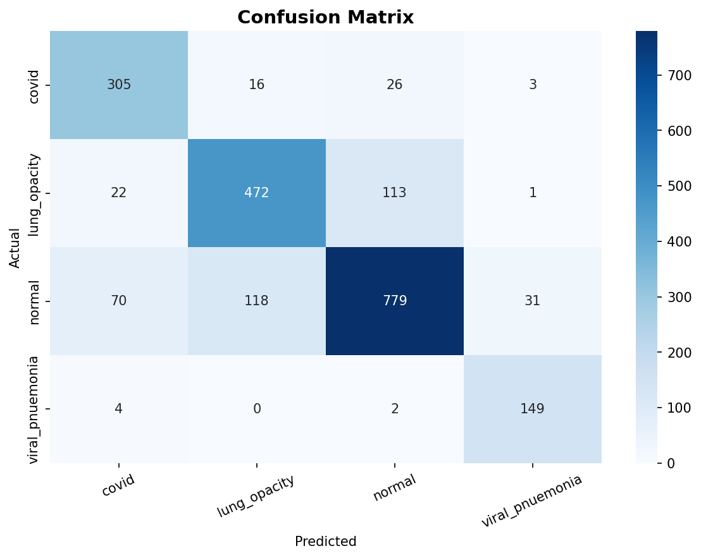

# 🫁 X-Ray Image Classification System — Custom CNN

> A Custom Convolutional Neural Network built from scratch to classify chest X-Ray images into 4 categories: **COVID-19, Lung Opacity, Normal, and Viral Pneumonia.**

---

## 📊 Results

| Metric | Value |
|---|---|
| Overall Accuracy | **80.67%** |
| Overall Error Rate | 19.33% |
| Best Class | Viral Pneumonia — 96.13% |
| Worst Class | Lung Opacity — 76.97% |

### Error Rate per Class

| Class | Error Rate |
|---|---|
| COVID-19 | 12.29% |
| Lung Opacity | 23.03% |
| Normal | 21.94% |
| Viral Pneumonia | 3.87% |

---

## 🏗️ Model Architecture



### Stage 1 — Feature Extraction (CNN)

| Block | Filters | Operation |
|---|---|---|
| Conv Block 1 | 32 | Conv2D (3×3) → BatchNorm → ReLU → MaxPool (2×2) |
| Conv Block 2 | 64 | Conv2D (3×3) → BatchNorm → ReLU → MaxPool (2×2) |
| Conv Block 3 | 128 | Conv2D (3×3) → BatchNorm → ReLU → MaxPool (2×2) |
| Conv Block 4 | 256 | Conv2D (3×3) → BatchNorm → ReLU → MaxPool (2×2) |

Output Feature Maps: **14×14×256**

### Stage 2 — Classification (Dense Network)

```
GlobalAveragePooling2D (256 values)
→ Dense 512  — ReLU + Dropout (0.6)
→ Dense 128  — ReLU + Dropout (0.4)
→ Output 4   — Softmax
```

**Total Trainable Parameters: 587,524**

---

## 📁 Dataset

- **Source:** [Chest X-Ray — Roboflow Universe](https://universe.roboflow.com/m-eqf3t/chest-x-ray-chee0/dataset/3)
- **License:** CC BY 4.0
- **Total Images:** 21,106
- **Image Size:** 224×224 Grayscale
- **Splits:**

| Split | Total | COVID | Lung Opacity | Normal | Viral Pneumonia |
|---|---|---|---|---|---|
| Train | 14,774 | 2,500 | 4,204 | 7,156 | 914 |
| Test | 2,111 | 350 | 608 | 998 | 155 |
| Valid | 4,221 | 715 | 1,200 | 2,037 | 269 |

> **Note:** Training was capped at **1,100 samples per class** to handle class imbalance.

---

## ⚙️ Training Configuration

| Parameter | Value |
|---|---|
| Image Size | 224×224 |
| Channels | 1 (Grayscale) |
| Batch Size | 32 |
| Optimizer | Adam |
| Learning Rate | CosineDecay (0.0003) |
| Loss | Categorical Crossentropy |
| Early Stopping | patience=5 |
| Max per Class | 1,100 |

---

## 📈 Training Results



---

## 🔀 Confusion Matrix



---

## 🚀 Setup & Installation

```bash
pip install -r requirements.txt
```

Download the dataset from [Roboflow](https://universe.roboflow.com/m-eqf3t/chest-x-ray-chee0/dataset/3) and place it inside the project folder so the structure looks like:

```
Dataset/
├── train/
├── test/
└── valid/
```

Then open `X-Ray-CNN.ipynb` and run all cells.

---

## 📂 Project Structure

```
Dataset/
├── train/
│   ├── covid/
│   ├── lung_opacity/
│   ├── normal/
│   └── viral_pnuemonia/
├── test/
├── valid/
├── X-Ray-CNN.ipynb
├── Architecture.png
├── confusion_matrix.png
├── training_history.png
├── xray_frequency_chart.png
└── requirements.txt
```

---

## 🛠️ Requirements

```
tensorflow==2.10.0
keras==2.10.0
numpy==1.24.3
pillow==12.0.0
matplotlib==3.10.8
seaborn==0.13.2
scikit-learn==1.7.2
```

---

## 📌 Notes

- Model built **from scratch** — no pretrained weights
- Data Augmentation applied on **train only** (rotation, zoom, contrast)
- `GlobalAveragePooling2D` used instead of `Flatten` to reduce parameters and overfitting
